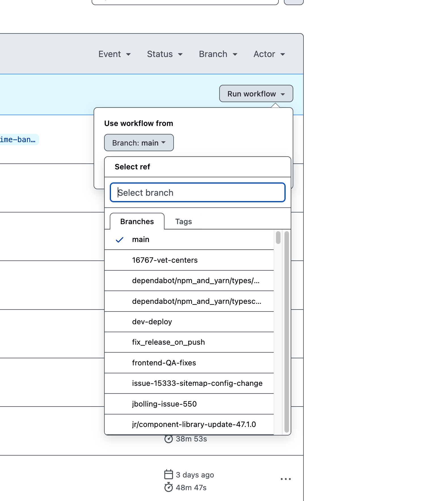

# Content Release

Content Release is what VA teams call the process of moving new published content in Drupal to [va.gov](https://va.gov).

See [CMS Content Release](https://github.com/department-of-veterans-affairs/va.gov-cms/blob/main/READMES/cms-content-release.md) for more information on how content release is currently triggered via CMS for `content-build` and BRD.

In the short term, next-build will operate in very much the same way. All content that is managed by Next Build will be built with each content release, regardless of whether it is new/changed or unchanged.

## Production content release

Production content release currently is triggered by the following events:

- On a schedule, every 30 minutes between 8 am and 8 pm ET
- Manually through the Github Actions interface
- When specific content is published in the CMS

Production content releases use https://prod.cms.va.gov/ as their content source.

## Dev and Staging content release

Dev and Staging content releases are triggered by the following events:

- On a schedule, nightly at 5:05 am ET or 5:35 am ET for Dev and Staging respectively. This keeps content relatively fresh even when there are no code changes to trigger a Dev or Staging content release.
- When any code is merged to the `main` branch of Next Build and has a successfull CI run on main - this is to keep Dev and Staging up-to-date with code changes they come in.
- Manually through the Github Actions interface

Dev and Staging content releases use https://main-medc0xjkxm4jmpzxl3tfbcs7qcddsivh.ci.cms.va.gov/ as their content source.

### Use of Dev and Staging content release for testing

Sometimes it is useful to deploy branches other than `main` to Dev or Staging for testing purposes. One reason to do this might be if Next Build frontend code needs to interact with https://dev-api.va.gov/ or https://staging-api.va.gov/. When frontend code is deployed to a Tugboat instance, it cannot make requests to an API instance, since it is blocked by CORS rules on the API instance. https://dev.va.gov/ and https://staging.va.gov/ are permitted to make client-side requests to the API instances, and so they're a suitable place to test code that needs to make these requests.

In order to run a content release to Dev or Staging, you would simply go to the [Content release: Dev workflow](https://github.com/department-of-veterans-affairs/next-build/actions/workflows/content-release-dev.yml) or the [Content release: Staging workflow](https://github.com/department-of-veterans-affairs/next-build/actions/workflows/content-release-staging.yml) and run the workflow manually, choosing your branch first:

This will take some time, but once the release is complete, a static build using your chosen branch will be on dev.va.gov or staging.va.gov.

It would be courteous to let the Next Build team know you are doing this but it's not critical. Once you are done with testing, it would also be nice to run another Content Release for your environment to restore the `main` branch. However, if you don't, the overnight release will restore `main`.

This is worth noting, in the event that you expect or need Dev or Staging to remain on a non-`main` branch overnight. In this case, you could disable the workflow to prevent the scheduled overnight build, if necessary.

# Archiving

Once a night, the current state of the front-end is archived to S3. This [archive workflow](/.github/workflows/archive.yml) behaves similarly to the content-release workflow described above, in that it also generates all static pages and their assets for use on S3. Once the build is complete, output is compressed to a `[git-hash].tar.gz` archive and pushed to separate S3 bucket for reporting purposes.

These archives ensure an easily available record of the state of VA.gov on any given day can be surfaced.
