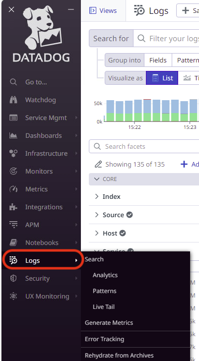
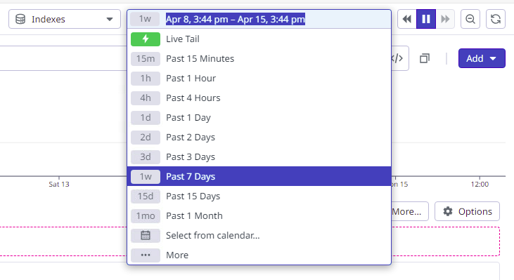
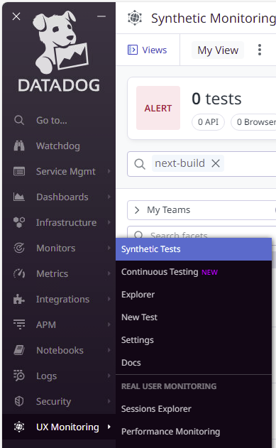
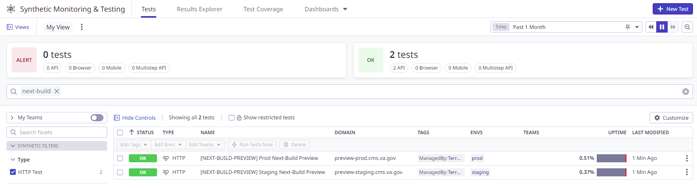
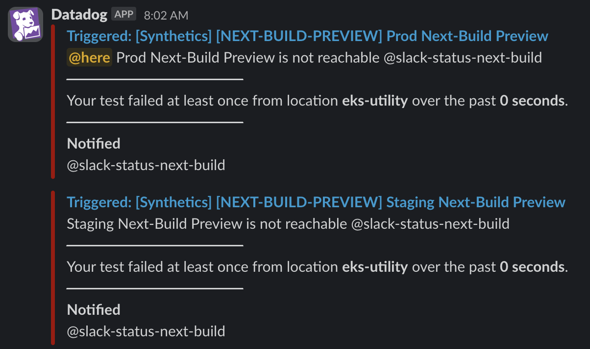

# Datadog Integration

## Logs

Each Kubernetes cluster ([dsva-vagov-staging-cluster](https://us-gov-west-1.console.amazonaws-us-gov.com/eks/home?region=us-gov-west-1#/clusters/dsva-vagov-staging-cluster) and [dsva-vagov-prod-cluster](https://us-gov-west-1.console.amazonaws-us-gov.com/eks/home?region=us-gov-west-1#/clusters/dsva-vagov-prod-cluster)) is configured with a Datadog agent to collect stdout and stderr. Within Datadog you can find the logs here:

Filter by `service:next-build-node` and by env (`eks-staging-test`, `eks-prod-test`, `eks-staging`, or `eks-prod`):

Adjust time range as needed to find the log entries you are interested in, or use Live Tail:

## Monitoring and Alerting

Two Datadog synthetics are deployed for monitoring staging and production next-build apps. These are defined using Terraform in the devops repo, in [terraform/environments/datadog/cms.tf](https://github.com/department-of-veterans-affairs/devops/blob/master/terraform/environments/datadog/cms.tf) (see `next_build_staging_preview_test` and `next_build_prod_preview_test`).

Each test alerts to the status-next-build Slack channel.

