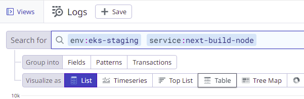

# Datadog Integration

## Logs

Each Kubernetes cluster ([dsva-vagov-staging-cluster](https://us-gov-west-1.console.amazonaws-us-gov.com/eks/home?region=us-gov-west-1#/clusters/dsva-vagov-staging-cluster) and [dsva-vagov-prod-cluster](https://us-gov-west-1.console.amazonaws-us-gov.com/eks/home?region=us-gov-west-1#/clusters/dsva-vagov-prod-cluster)) is configured with a Datadog agent to collect stdout and stderr. Within Datadog you can find the logs here:

Filter by `service:next-build-node` and by env (`eks-staging-test`, `eks-prod-test`, `eks-staging`, or `eks-prod`):

Adjust time range as needed to find the log entries you are interested in, or use Live Tail:

## Monitoring and Alerting

TODO: awaiting PR approval
