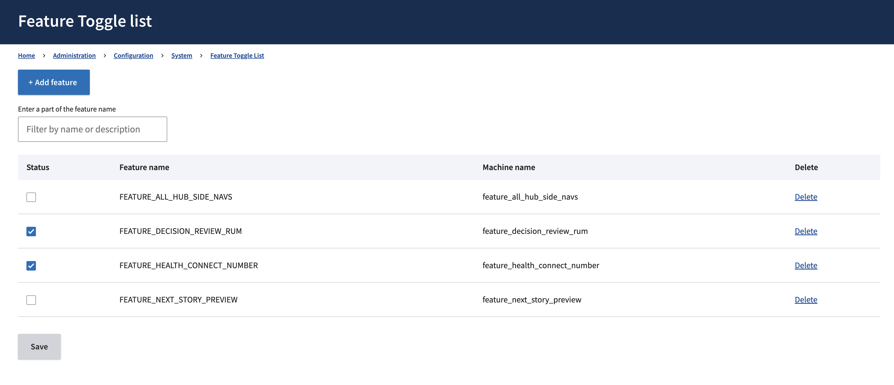

# Layout rollout

Creating a template for CMS content in Next Build requires coordination between Next Build and the CMS. Migrating an existing template in Content Build into Next Build additionally requires coordination in that repo.

We want to be able to work on a layout without fear that Next Build will attempt to build and deploy the template before it is ready. We also want to be able to control whether the template is built from one system or the other, without needing to coordinate deploys.

## CMS feature flags

The CMS has a feature flag system which it calls 'Feature Toggles'. These are strings with a corresponding boolean value, which can be controlled through the CMS admin UI.

### Admin

In the CMS, the Feature Toggle admin can be found at [https://prod.cms.va.gov/admin/config/system/feature_toggle](https://prod.cms.va.gov/admin/config/system/feature_toggle) for Prod, or the equivalent URL on the CMS environment you're working with (admin required).



A checked value corresponds to 'on' or 'true' for the string in question.

### Adding a new feature flag

Adding a new feature flag is a CMS code change. The list of feature flags is maintained in the repo at [config/sync/feature_toggle.features.yml](https://github.com/department-of-veterans-affairs/va.gov-cms/blob/main/config/sync/feature_toggle.features.yml). Adding a new flag is as simple as adding a new item under `features:`.

### Using feature flags in code

#### Next Build

In Next Build, the feature flag values for the connected CMS instance are made available as environment variables. So for example, if there is a feature flag `FEATURE_NEXT_BUILD_CONTENT_LANDING_PAGE` in the CMS, in Next Build it can be referenced at any time via `process.env.FEATURE_NEXT_BUILD_CONTENT_LANDING_PAGE`.

An enabled feature flag environment variable has a **string** value of `'true'`. Any other value is false.

#### Content Build

In Content Build, CMS feature flags are loaded as a global. They can be referenced with this code line:

```
  const { cmsFeatureFlags } = global;
```

This global variable becomes available after options have loaded, and cannot be referenced until then.

In Content Build, feature flag values are 'truthy' or 'falsy'. For example, `cmsFeatureFlags.FEATURE_ALL_HUB_SIDE_NAVS` will evaluate to `true` or `false` and can be used as such.

#### CMS

In the CMS, the class that allows code to retrieve flag values is `Drupal\feature_toggle\FeatureStatus`. Typically, this class is loaded into another class via dependency injection. Values can be retrieved via the method `FeatureStatus->getStatus($flag_name)`.

## CMS requirements for rollout

In order for rollout to proceed, a few things need to be done on the CMS side.

1. **The content type must exist in the CMS.** This should be obvious, but you cannot retrieve data for a content type if it doesn't exist.

1. **A Next Drupal content entity must exist for the content type.** The primary function of this content entity is to control how the CMS manages content preview for the content type. The procedure for creating a content entity is described in the [Preview documentation under "Content Configuration"](./preview.md#content-configuration).

1. **A feature flag must exist for the content type.** Feature flags for content types are of the form `FEATURE_NEXT_BUILD_CONTENT_<MACHINE_NAME>`, where the machine name is the machine name of that content type in Drupal, in all caps. The machine name should match the machine name in Drupal, even if that machine name is truncated or misspelled. So for example:

   - `FEATURE_NEXT_BUILD_CONTENT_VBA_FACILITY`
   - `FEATURE_NEXT_BUILD_CONTENT_HEALTH_CARE_REGION_DETAIL_PAGE`
   - `FEATURE_NEXT_BUILD_CONTENT_VAMC_SYSTEM_MEDICAL_RECORDS_OFFI`

## Next Build use of feature flags

When Next Build connects to a CMS instance, it will load the feature flag state of that CMS instance. In [[[...slug]].tsx](./[[...slug]].md), this feature flag state is used to determine whether a content type should be allowed to build or not. This is in addition to the addition of a given content type to `PAGE_RESOURCE_TYPES` in [resourceTypes.ts](../src/lib/constants/resourceTypes.ts).

If the feature flag for a given content type is not active, or an equivalent environment variable is not set for that content type, [[[...slug]].tsx](./[[...slug]].md) will not build the page.

### Development

During local development, you will need to activate the content type's feature flag or environment variable, so that you can build pages that are otherwise not active. This can be done one of two ways:

1. **Turn the flag on in your local CMS.** If you are developing against a local CMS, you are free to enable the appropriate flag in that CMS. This will be located at https://va-gov-cms.ddev.site/admin/config/system/feature_toggle.

2. **Set the environment variable in your .env.local file.** You can enable a specific content type by adding its environment variable with a value of `true`. This will override the flag value you are receiving from the CMS instance.

   For example, if you want to enable the Vet Center content type (machine name `vet_center`), you would add the following to your .env.local file:

   ```
   FEATURE_NEXT_BUILD_CONTENT_VET_CENTER=true
   ```

   Alternately, setting the following special environment variable will bypass the flag system and enable all content types that Next Build is aware of:

   ```
   FEATURE_NEXT_BUILD_CONTENT_ALL=true
   ```

   It is best to only use this environment variable locally.

### Review & Tests

In order to effectively review and test the use of these flags, they will need to be enabled for the Tugboat and Test environments. This is because those environments make use of databases that derive from the Production database, and the feature flags must not be set on the Production CMS.

When you are submitting a PR, add your feature flag variable to .env.test and .env.tugboat, so that the content type is enabled for those environments.

### Feature Flag variables on Dev, Staging, Prod

When you are merging a new layout template and need to test it on Dev and Staging, you will need to add the feature flag variable to those environments. This is because the database for those environments is derived from the Production database, and the feature flag should not be enabled on Production until launch. These will need to be added to .env.dev and .env.staging, if testing on those environments is desired.

Feature flag variables should _never_ be added to the .env.prod file. Feature flags on Prod must _always_ be controlled from the Prod CMS itself.

## Content Build use of feature flags

Feature flag usage in Content Build will primarily consist of disabling certain GraphQL queries. This should only be done if you feel very confident that you can roll out the content type in Next Build and simultaneously disable it in Content Build without issues.

Work will most likely be done in [GetAllPages.graphql.js](https://github.com/department-of-veterans-affairs/content-build/blob/main/src/site/stages/build/drupal/graphql/GetAllPages.graphql.js), as this is where full retrieving of content types takes place. Let's say we want to allow Event Listing queries to be controlled by flags. The [Event Listing query fragment](https://github.com/department-of-veterans-affairs/content-build/blob/main/src/site/stages/build/drupal/graphql/GetAllPages.graphql.js#L118) is included in a larger GraphQL query which is structured as a string literal:

```Javascript
// Surrounding context removed; see link above
`
        ... bioPage
        ... benefitListingPage
        ... nodeEventListing
        ... nodeEvent
        ... storyListingPage
`
```

Using the flag can be done by using `${}` within that string literal to include JavaScript that can be interpolated:

```Javascript
`
        ... bioPage
        ... benefitListingPage
        ${
        // If the flag is not present and set, query and build event listings.
        !cmsFeatureFlags.FEATURE_NEXT_BUILD_CONTENT_EVENT_LISTING
        ? `... nodeEventListing`
        : ''
        }
        ... nodeEvent
        ... storyListingPage
`
```

Note the negation in front of the feature flag value. In most cases we want this code to be active when the feature flag is _inactive_. Activating the feature flag should deactivate the code.

## Rollout

In order to roll out a content type on production, the procedure is simple:

1. **Ensure the flag for that content type is not checked in the Prod CMS.** This should be true from the beginning of the development process, but it is important to check this before deployment.

1. **Deploy all code for Next Build and Content Build (if using flags in Content Build).** Provided the flag is inactive, code handling the templating of a given content type will not become active in production. Code deployments do not need to be coordinated.

1. **Enable the flag in the Prod CMS.** This will activate the content type. When the flag becomes active, the following thing happen:

   a. Next Build production will become able to build the content type.

   b. If flags are used in Content Build, the change will also become active there. Typically this would turn off that content type in Content Build.

   c. CMS will begin using Next Build Preview Server links for that content type. Without the flag active, a content type will use Content Build Preview for its preview. Turning the flag on tells the CMS to use the Next Build link.
