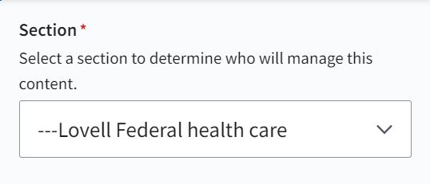
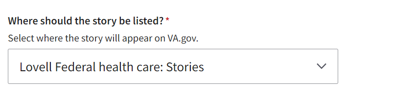

# Lovell

## Background

Lovell Federal health care represents an exceptional case in how healthcare systems are handled in our information architecture.

### Information Architecture

Unlike the rest of the VAMC Systems, `Lovell Federal health care` is comprised of both a VA entity _and_ a DOD (Department of Defense) entity. This DOD side is called "TRICARE". In order to accommodate this exceptional case, there's an additional level of organization introduced _only for this system_ in Drupal:

#### Organizational Levels

##### Default

`VAMC System --> VAMC Facility`

E.g.

`Minneapolis health care --> Minneapolis VA Medical Center`

##### Lovell

`VAMC System --> VA/TRICARE --> Facility`

E.g.

`Lovell Federal health care --> Lovell Federal health care VA --> Evanston VA Clinic`

`Lovell Federal health care --> Lovell Federal health care TRICARE --> USS Red Rover`

#### Taxonomy/Content Implications

Importantly, there are also exceptional mechanisms in place to assign content to the various organizational levels within Lovell Federal Healthcare:

- Often, a news story, for example, applies to both VA and TRICARE. Rather than requiring an editor to create the story twice, the editor can assign it to the parent (Federal) level to indicate that it should apply to both VA and TRICARE.

  

- There is no need for a listing page at the Federal level. This taxonomy term exists only to indicate a resource should appear on both listing pages (VA and TRICARE).

  

## Application Architecture

As a result of this special-case organization, Lovell also represents an exceptional case with regard to how we handle certain things in this codebase. In short, our code needs to implement the rules laid out in the section above about taxonomy and content implications.

There are three main pieces to handling these features. We'll examine them in the context of a news story.

### Lovell Architecture

#### Bifurcation

> Often, a news story, for example, applies to both VA and TRICARE. Rather than requiring an editor to create the story twice, the editor can assign it to the parent (Federal) level to indicate that it should show up on both VA and TRICARE listing pages.

"Bifurcation" means, simply, that something is divided into two branches. This concept is important in the context of building pages for individual news stories. When the build finds a news story that is assigned to Lovell Federal (the parent level), it needs to do two things:

1. During static-path generation, it needs to generate TWO static paths - one for VA and one for TRICARE. Let's say the story is titled: "My News Story". Then, the build needs to generate these paths:

- `lovell-federal-health-care-va/my-news-story`
- `lovell-federal-health-care-tricare/my-news-story`

2. During individual page generation, the build will then need to build _both_ of those pages. In each case, it needs to know to fetch the _same_ data, and build the same page.

#### Listing-Page merger

Considering this same scenario, there's also important work that needs to be done to generate the listing pages for both VA and TRICARE. Understanding this effectively boils down to acknowledging that the listing page for, say, VA, will be comprised of news stories that are assigned _either_ to the VA level _or_ the parent level.

So, generating the VA listing page amounts to _merging_ the stories that are assigned to the VA level with the stories that are assigned to the Federal level. For TRICARE, we merge the stories that are assigned to the TRICARE level with the stories that are assigned to the Federal level.

#### Federal Listing-Page Removal

> There is no need for a listing page at the Federal level. This taxonomy term exists only to indicate a resource should apply to both children (VA and TRICARE).

The Federal listing page is simply a bucket for indicating stories that should appear on both the VA and TRICARE listing pages. We do not actually ever build the Federal listing page. So, during static-path generation, we remove this item from the collection of paths.
