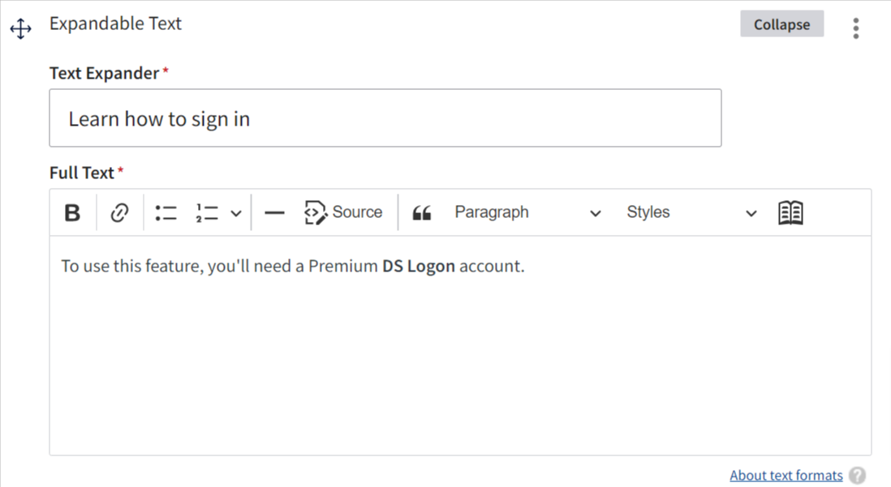

# Paragraphs

## Overview

Paragraphs, like nodes, are a type of entity type in Drupal. They represent content saved by editors. But, unlike nodes, which generally represent content that will become individual pages on the front end, paragraphs represent smaller pieces of content that can be added within nodes (and, also, within other paragraphs). Like nodes, paragraphs can be defined with various fields depending on specific content needs. At a high level, paragraphs provide a way for editors to add standardized, structured content to their pages.

### Example

Let's take a look at an example from our code base. On many different pages, we have the need for displaying text that becomes visible only after the user clicks on a header to expand it:

Collapsed:


Expanded:


In order to accommodate this need, we provide a paragraph type called "Expandable Text". When an editor wants to add expandable text to the page, that editor will see a UI element in Drupal that looks like this:



Then, in our code, we define a component that can render this specific paragraph type as shown in the screenshots above:

```
export function ExpandableText({
  id,
  header,
  text,
}: ParagraphComponent<FormattedExpandableText>) {
  if (isEmpty(header)) return

  return (
    <VaAlertExpandable id={id} trigger={header}>
      {text && (
        <div
          dangerouslySetInnerHTML={{
            __html: text,
          }}
        />
      )}
    </VaAlertExpandable>
  )
}
```

## Paragraph Component

### Background

It's not always the case, though, that we know definitively what type of paragraph a certain field contains. In many cases, an editor can attach many different types of paragraphs to a certain field. As a result, we often can't explicitly call `<ExpandableText>`, as in the example above, because the field that it might be attached to could hold paragraphs of many types.

So, enter the `<Paragraph>` component. This component is located at [src/templates/components/paragraph/index.tsx](https://github.com/department-of-veterans-affairs/next-build/blob/main/src/templates/components/paragraph/index.tsx) with corresponding tests located at [src/templates/components/paragraph/index.test.tsx](https://github.com/department-of-veterans-affairs/next-build/blob/main/src/templates/components/paragraph/index.test.tsx). The primary purpose of this component is to create an abstraction for paragraphs that can cleanly render paragraphs when it isn't necessarily specified what kind of paragraph structure can be expected.

### Paragraph Component Functionality

At a high level, this is simply a switch case that takes in a Drupal paragraph as an object with a type key and returns the corresponding paragraph for that type:

```
export const Paragraph = (paragraph: FormattedParagraph) => {
  switch (paragraph.type) {
    case PARAGRAPH_RESOURCE_TYPES.ACCORDION_ITEM:
      return <AccordionItem {...(paragraph as FormattedAccordionItem)} />

    case PARAGRAPH_RESOURCE_TYPES.ALERT:
      return <Alert {...(paragraph as FormattedAlert)} />

    .
    .
    .

    case PARAGRAPH_RESOURCE_TYPES.WYSIWYG:
    case PARAGRAPH_RESOURCE_TYPES.RICH_TEXT_CHAR_LIMIT_1000:
      return <Wysiwyg {...(paragraph as FormattedWysiwyg)} />

    default:
      return null
  }
}
```

### Format Paragraph Functionality

Located at [src/lib/drupal/paragraphs.ts](https://github.com/department-of-veterans-affairs/next-build/blob/main/src/lib/drupal/paragraphs.ts), the `formatParagraph` function is an abstraction for calling `queries.formatData` that removes the need to explicitly pass the paragraph type as a parameter, since that property should always be available on the paragraph itself.

```
export const formatParagraph = <T extends FormattableParagraphResourceType>(
  paragraph: DrupalParagraph
): FormattedResourceByType<T> => {
  if (!paragraph) {
    return null
  }

  try {
    return queries.formatData(
      paragraph.type as T,
      paragraph as DrupalResourceByType<T>
    )
  } catch (err) {
    return null
  }
}
```

This function allows us to circumvent some type assertion issues that would otherwise arise by simply calling `queries.formatData(paragraph.type, paragraph)`.

### Example

Let's take a look at an example to see this piece of the puzzle in action. Here, we'll look at an example of a paragraph that can itself reference other paragraphs. We see this in the `qaParagraph` component and its corresponding Drupal paragraph type, `paragraph--q_a`.

If we examine the Q&A paragraph type in Drupal - [https://staging.cms.va.gov/admin/structure/paragraphs_type/q_a/fields](https://staging.cms.va.gov/admin/structure/paragraphs_type/q_a/fields) - we see that the `field_answer` field can hold a number of different paragraph types (Rich text, Accordion group, Process list, Number callout, Alert, React Widget, or Table, as of this writing, and could potentially hold additional types in the future).

As such, in [src/types/formatted/qaParagraph.ts](https://github.com/department-of-veterans-affairs/next-build/blob/main/src/types/formatted/qaParagraph.ts) we define the type of our `answers` property to be a collection of generic paragraphs, rather than a specific paragraph:

```
export type QaParagraph = PublishedParagraph & {
  question: string
  answers: FormattedParagraph[]
  type: string
  setHeaderh3?: boolean
}
```

Then, in [src/data/queries/qaParagraph.ts](https://github.com/department-of-veterans-affairs/next-build/blob/main/src/data/queries/qaParagraph.ts), in our `qaParagraph` formatter, we format the `answers` property by passing `field_answers` through the `formatParagraph` function we saw above:

```
export const formatter: QueryFormatter<ParagraphQA, QaParagraph> = (
  entity: ParagraphQA
) => {
  return {
    type: entity.type as QaParagraph['type'],
    question: entity.field_question,
    answers: entity.field_answer
      ? entity.field_answer.map(formatParagraph)
      : [],
    id: entity.id,
  }
}
```

Finally, this data is then able to be used in the [`qaParagraph` component](https://github.com/department-of-veterans-affairs/next-build/blob/main/src/templates/components/qaParagraph/index.tsx) by mapping over the array of formatted paragraphs and calling the paragraph component for each:

```jsx
<div>
  {answers.map((answer, index) => {
    return <Paragraph key={index} {...answer} />
  })}
</div>
```

We can examine one last piece of this by looking at our unit tests. In [our mock data for `qaParagraph`](https://github.com/department-of-veterans-affairs/next-build/blob/main/src/mocks/qaParagraph.mock.json), observe that the `field_answer` field has a `paragraph--wysiwyg` reference in it:

```
"field_answer": [
    {
      "type": "paragraph--wysiwyg",
      "id": "f6dfd8da-877f-46bd-9707-28861c27003e",
      "drupal_internal__id": 2754,
      .
      .
      .
```

This is because `field_answer` _can_ hold a `wysiwyg` paragraph. As we saw above, though, it can _also_ hold other types of paragraphs. As such, we could quicky test, that any content type could be passed into that answers array and render the expected output.
