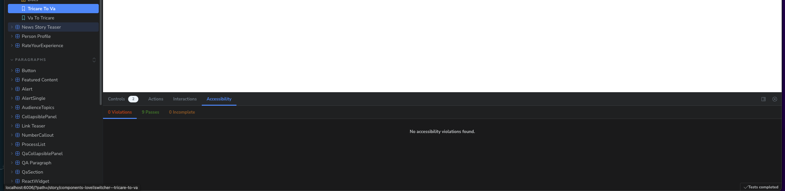
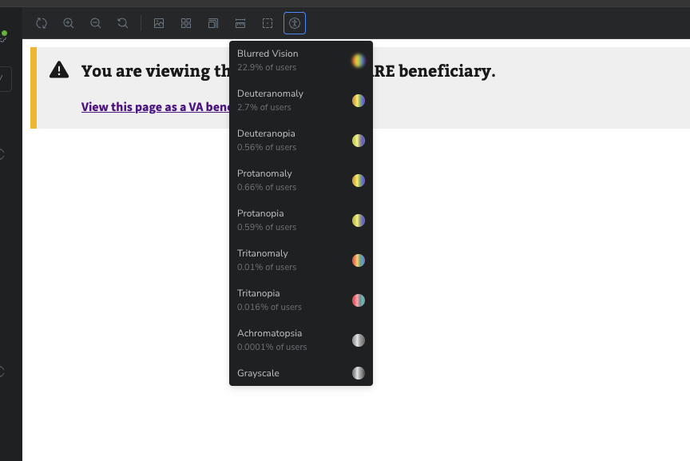

# Storybook

Next-build uses [Storybook](https://storybook.js.org/) to help build and test front-end components and layouts in isolation.

To view the latest version on the web, visit the [main tugboat preview](https://storybook-kqjsor0i3mjdwsy9gojxhhyvdzh0wubb.tugboat.vfs.va.gov/). SOCKS access is required.

## Quickstart

1. Install packages with `yarn`
2. Run `yarn storybook` to start the application locally.
3. Visit http://localhost:6006/

See the VA Design System Team's [How to use Storybook](https://design.va.gov/storybook/?path=/docs/about-how-to-use-storybook--page) page for a helpful explainer of how to navigate the Storybook UI.

## Mocking Data

It's helpful to see components with reasonably accurate mock data, to better understand interactions with various states and configurations. Data can be mocked for stories and their variants in several ways.

- You can import existing mock data structures and pass to your component from the `@/mocks/` directory.

  - See `storyListing.stories.tsx` or `wrapper.stories.tsx` for examples

- You can write everything as inline `args`, to make the component fully dynamic in Storybook.

  - `newsStoryTeaser.stories.tsx` has an example of this

- You can use `msw` to mock an API call and its response before rendering your component. The mock data would likely come from `@/mocks/` directory here too. None of the stories currently do this, as they are generally static pages or components. But it is an option.

@TODO: we should have a `mockResponse` and a `mockFormat` for most/all data types. This will help consistency in tests & stories.

## Using the Design System

Next-build imports the VA Design System. These styles are imported into Storybook and the overall next-build application for you automatically.

See the **[VA.gov Design System](https://design.va.gov/foundation/)** for more information about the available CSS utility classes.

To see where these are imported, look at the following files for next-build:

- `@/assets/styles/globals.css`
- `@/pages/app.tsx`
- `@/pages/_document.tsx`

For Storybook:

- `.storybook/preview.tsx`

## Using the Design System's web components or vets-website widgets

Next-build imports web components from the VA Design System as well as widgets from vets-website (Header, Footer, Facility Sidebar Navigation, etc.)

**[v3 components](https://design.va.gov/components/) from the Design System should be used whenever possible!**

Some of the widgets from vets-website may need additional data passed to them via the `window` object.
If this happens in the component itself, these values can be passed in as props in storybook. See `wrapper.stories.tsx`.

For components that do not need extra data passed to them, we have a Storybook Decorator automatically applied to all stories by default, so they "just work".
This decorator stubs out some `window` object data for widgets to load correctly, as we currently add the full `static-pages-entry` bundle from vets-website to all static pages.
See `@/stories/webComponentProvider.tsx` and `.storybook/preview.tsx` for more information.

## Accessibility testing

Components in Storybook can be tested for accessibility compliance when viewing a story in canvas mode (i.e. not the `Docs` entry under a given header)

Hit `a` to bring up the bottom action toolbar if it's closed, and click to the `Accessibility` tab to see the checks performed and any violations found.

You can also hit the accessibility icon in the top toolbar to apply various filters in order to examine a component's usability for various visual impairments that users may experience.

## Further reading:

- [VA.gov Design System](https://design.va.gov/about/)
- [VA.gov DS Storybook](https://design.va.gov/storybook/)
- [Build a Next.js app in Storybook with React Server Components and Mock Service Worker](https://storybook.js.org/blog/build-a-nextjs-app-with-rsc-msw-storybook/)
